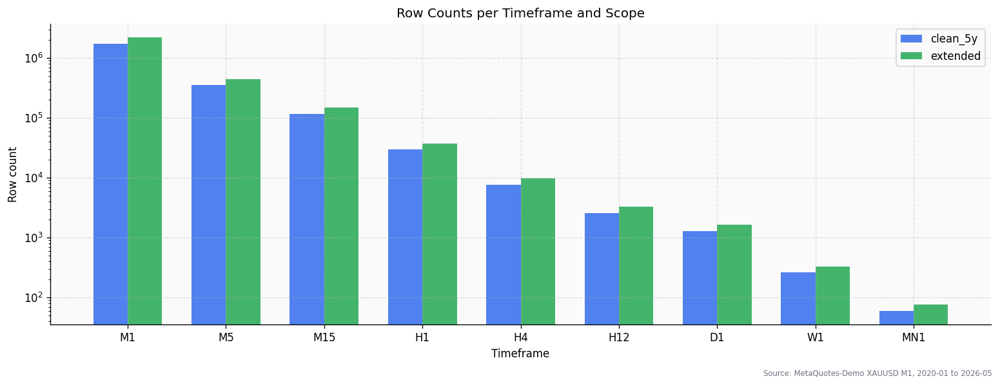
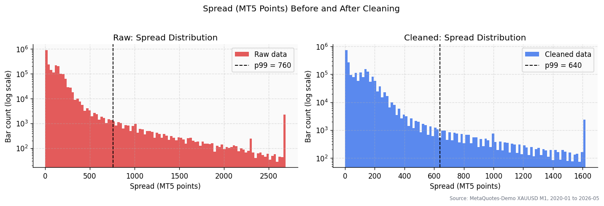
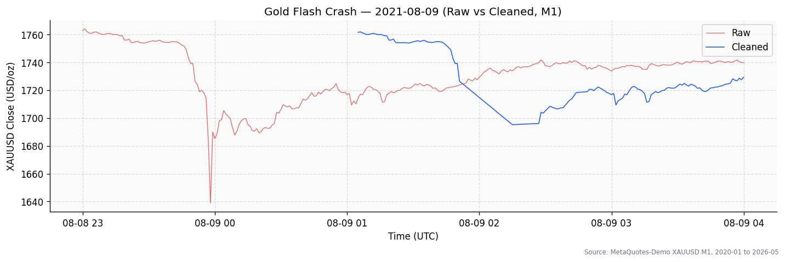

# Time Series Data Preparation

Production-grade time-series data preparation for XAUUSD: from messy MT5 export to clean Parquet/DuckDB at 9 timeframes.

[Live demo site](https://mseyyiddev.github.io/time-series-data-preparation/) - static GitHub Pages dashboard with the cleaned sample, diagnostic figures and downloadable Parquet outputs.

[](https://github.com/MSeyyidDev/time-series-data-preparation/actions/workflows/ci.yml)
[](https://www.python.org/downloads/release/python-3110/)
[](LICENSE)
[](https://github.com/astral-sh/ruff)

---

## Why this project

Raw broker exports from MetaTrader 5 are not analysis-ready: timestamps are in
broker time, the spread column contains extreme outliers from rollover windows
and flash crashes, OHLC values occasionally violate basic sanity constraints,
and the single large CSV carries no schema enforcement at all. Before any
quantitative analysis can happen, this mess needs to be cleaned, normalized, and
reshaped into a reliable format.

This project delivers that foundation. It takes the raw XAUUSD M1 CSV (2.2 million
rows, 2020–2026) and produces deterministic, schema-validated Parquet files and a
DuckDB database at nine timeframes — the exact input a downstream quant analysis
project needs.

---

## Quick start

```bash
git clone https://github.com/MSeyyidDev/time-series-data-preparation.git
cd time-series-data-preparation
pip install -e ".[dev]"
tsdataprep run-all --input data/raw/XAUUSD_M1.csv --out data/processed
pytest
```

See [docs/quickstart.md](docs/quickstart.md) for the full step-by-step guide
including Docker usage and DuckDB query examples.

---

## What the pipeline does

The pipeline is a linear ETL that runs on the raw M1 bars before resampling.

**Cleaning rules applied to M1 (spec §4):**

- **Parse and deduplicate** — merges `<DATE>` and `<TIME>` into a single UTC
  timestamp, drops exact duplicate rows.
- **OHLC sanity check** — drops bars where `high < low` or open/close fall
  outside `[low, high]` or any price is zero or negative.
- **Spread outlier filter** — computes the per-year 99th percentile of
  `spread_points` and drops any bar exceeding it. Rollover and news bars with
  extreme spreads are not tradeable and would distort statistics.
- **Return-explosion filter** — drops bars where `|ret_1m| > 8 * MAD` AND
  `spread_points > per-year p95`. The dual condition preserves genuine fast
  moves (e.g. NFP) while removing corrupted data. This rule catches the
  **August 9, 2021 gold flash crash** (bars at ~01:57 UTC+2 with
  `spread_points ≈ 9,000` and `ret_1m ≈ -2.7%`) — the most dramatic data
  quality event in the dataset.
- **Date window trim** — produces two scopes: `clean_5y` (2020–2024 complete
  years) and `extended` (2020–2026-05-08).
- **Spread normalization** — adds `spread_pips = spread_points / 10` (gold
  CFD convention: 1 pip = $0.10). The pipeline records median and mean spread
  in the quality report and emits warnings when broker-specific values fall
  outside the expected validation band.

Every dropped row is logged with a reason code to `data/processed/quality_report.json`.
A `manifest.json` records input sha256, row counts, parameters, and package
versions for full reproducibility.

**Output:**

- Hive-partitioned Parquet files (`year=YYYY` sub-directories) per timeframe and scope.
- A single `xauusd.duckdb` file with one table per timeframe.
- Three diagnostic figures (price overview, spread distribution, flash crash zoom).

---

## Output schema

The canonical schema applied to every output file (spec §3.1):

| Column         | dtype                  | Notes                                        |
|----------------|------------------------|----------------------------------------------|
| `ts`           | `timestamp[ns, UTC]`   | Bar open time, UTC, monotonically increasing |
| `open`         | float64                | Bar open price (USD per troy ounce)          |
| `high`         | float64                | Bar high price                               |
| `low`          | float64                | Bar low price                                |
| `close`        | float64                | Bar close price                              |
| `tick_volume`  | int64                  | Number of tick changes during the bar        |
| `real_volume`  | int64                  | Traded volume (0 for most CFD instruments)   |
| `spread_points`| int32                  | Raw MT5 spread in points (1 point = $0.01)   |
| `spread_pips`  | float32                | `spread_points / 10` (gold pip convention)   |

---

## Timeframes

Nine timeframes are produced from the cleaned M1 data:

| Code | Description  | pandas alias | Bars/year (approx) |
|------|--------------|--------------|--------------------|
| M1   | 1 minute     | `1min`       | ~261,000           |
| M5   | 5 minutes    | `5min`       | ~52,200            |
| M15  | 15 minutes   | `15min`      | ~17,400            |
| H1   | 1 hour       | `1h`         | ~4,350             |
| H4   | 4 hours      | `4h`         | ~1,090             |
| H12  | 12 hours     | `12h`        | ~365               |
| D1   | 1 day        | `1D`         | ~261               |
| W1   | 1 week       | `1W`         | ~52                |
| MN1  | 1 month      | `1MS`        | ~12                |

See [docs/timeframes.md](docs/timeframes.md) for pandas resampling parameters,
output layout, DuckDB table names, and guidance on when to use each timeframe.

---

## Tech stack

| Layer        | Technology                                             |
|--------------|--------------------------------------------------------|
| Data         | pandas 2.x, numpy, pyarrow                            |
| Storage      | Apache Parquet (Hive-partitioned), DuckDB              |
| CLI          | Typer, Rich                                            |
| Visualization| matplotlib, plotly                                     |
| Testing      | pytest, pytest-cov                                     |
| Linting      | ruff                                                   |
| Type checking| mypy                                                   |
| Containers   | Docker, Docker Compose                                 |
| CI           | GitHub Actions                                         |

No ML frameworks, no `ta-lib`. This project is data preparation only.

---

## Project layout

```
time-series-data-preparation/
  src/
    tsdataprep/
      __init__.py       package init, version
      cli.py            Typer CLI (six subcommands)
      config.py         constants, paths, scope definitions
      io.py             parse_raw(), load_parquet()
      clean.py          clean_m1(), OHLC + spread + return filters
      normalize.py      normalize(), spread_pips, validator
      validate.py       schema + monotonic timestamp checks
      resample.py       resample_all(), write_parquet(), write_duckdb()
      visualize.py      generate_figures(), flash_crash_zoom()
  tests/
    conftest.py         shared fixtures (synthetic 10k-row DataFrame)
    fixtures/
      sample_m1.csv     1 000-row synthetic MT5 data for CI
    test_io.py
    test_clean.py
    test_normalize.py
    test_validate.py
    test_resample.py
    test_visualize.py
  scripts/
    01_inspect.py
    02_clean.py
    03_resample.py
    04_visualize.py
  docs/
    architecture.md
    data-sources.md
    normalization.md
    timeframes.md
    quickstart.md
  data/
    raw/        (place XAUUSD_M1.csv here — not committed)
    interim/    (intermediate artefacts — not committed)
    processed/  (pipeline output — not committed)
  reports/
    figures/    (PNG/HTML plots — not committed)
  Dockerfile
  docker-compose.yml
  pyproject.toml
  Makefile
  tasks.ps1
```

---

## Docker usage

Build once, run the full pipeline inside a container:

```bash
docker compose up etl
```

The container mounts `./data` and `./reports` from your host, runs
`tsdataprep run-all`, and exits. No local Python install needed.

For individual steps or interactive exploration, override the command:

```bash
docker run --rm -v $(pwd)/data:/app/data tsdataprep:latest \
    tsdataprep inspect --input data/raw/XAUUSD_M1.csv
```

---

## Sample figures

The pipeline generates three diagnostic figures:

**Price overview — full XAUUSD M1 close price 2020–2026:**



**Spread distribution before and after cleaning:**



*The long right tail (rollover and flash-crash bars) is removed by the
spread-outlier and return-explosion filters.*

**August 2021 flash crash zoom (2021-08-09):**



*The two bars at ~01:57 UTC+2 with spread_points > 9,000 are flagged and
dropped. See [docs/normalization.md](docs/normalization.md) for full details.*

---

## Sources

1. **MT5 historical data export format** — MetaQuotes MQL5 community forum,
   "How to export quotes from MetaTrader 5?":
   https://www.mql5.com/en/forum/227308

2. **MT5 export walkthrough** — StrategyQuant documentation,
   "How to Export Data from Metatrader 5":
   https://strategyquant.com/doc/quantdatamanager/how-to-export-data-from-metatrader-5/

3. **August 9, 2021 gold flash crash** — FX Empire,
   "Gold Bounces Off $1,678; The Low of the August 2021 Flash Crash":
   https://www.fxempire.com/forecasts/article/gold-bounces-off-1678-the-low-of-the-august-2021-flash-crash-1072038

4. **XAUUSD pip and point convention** — Ultima Markets Academy,
   "What is 1 Pip in XAUUSD? How to Calculate?":
   https://www.ultimamarkets.com/academy/what-is-1-pip-in-xauusd-how-to-calculate/

5. **pandas resample and time series offset aliases**:
   https://pandas.pydata.org/pandas-docs/stable/user_guide/timeseries.html

6. **Apache Parquet file format** — official documentation:
   https://parquet.apache.org/docs/

7. **DuckDB in-process OLAP database** — official documentation:
   https://duckdb.org/docs/current/

See [docs/data-sources.md](docs/data-sources.md) for extended sourcing notes,
column-level documentation, and the full flash crash case study.

---

## Roadmap / next steps

- **Real quant analysis on this output** — the next project will consume
  `xauusd.duckdb` directly: trend filters, volatility regimes, and a simple
  mean-reversion backtest on D1 data.
- **Live data refresh** — add an `update` subcommand that appends new MT5
  M1 bars to the existing Parquet partition without reprocessing historical data.
- **Additional instruments** — the pipeline is parameterized for any MT5
  OHLCV export; the next step is adding EURUSD and BTCUSD for cross-asset
  correlation analysis.

---

## License

MIT License — Copyright (c) 2026 Seyyid Sahin. See [LICENSE](LICENSE).

